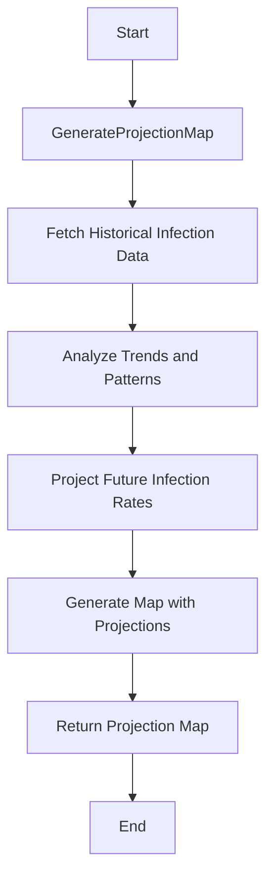

# Midterm Design Challenge: Data Source Layer
Author: Judrianne Mahigne

NJIT Email: jm2489@njit.edu

This is the Data Source Layer description for the fall 2024 IT490 - Systems Integration midterm design project.

## Table of Contents

- [Overview](#overview)
- [Implementation](#implementation)
- [Security](#security)
- [Technologies](#Technologies)

## Overview
The Data Source Layer is in charge of processing incoming data and overseeing communications with external APIs. This layer will gather, compile, and process the data needed for the front-end application by communicating with the mapping API and REST API. For this we are going to implement Python or PHP as the programming language for processing API requests.

## Implementation

### 1. API Integration
The data source layer makes the following REST based API calls. All information are returned as JSON encoded format:
- **ListParticipants**: Retrieve a list of people tracked by the system.
  
  **HTTP Method**: `GET`
  
  **Endpoint**: `/listParticipants`

  **Information Returns**:
  - ParticipantId `<id>` - A unique number for the participant
  - Age `<age>` - The age of the participant. A number in years.

- **GetParticipantLocations(ParticipantId)**: Fetches GPS coordinates for a given participant.
  
  **HTTP Method**: `GET`
  
  **Endpoint**: `/getParticipantLocations/<id>`

  **Information Returns**:
  - GPS `<latitude>,<longitude>` - GPS coordinates.
  - Timestamp `<created_at>` - Time saved as an epoch when the data was created.

- **GetParticipantData(ParticipantId)**: Get detail information about the participant
  
  **HTTP Method**: `GET`
  
  **Endpoint**: `/getParticipantData/<id>`

  **Information Returns**:
    
    - Infected `<infected>`- NULL if not infected, A datetime of the time of known contact otherwise
    - Recovered `<recovered>`- NULL if never infected, TRUE if the patient recovered (and is assumed immune), False if currently infected
    - RecoverTime `<recover_time>`- NULL if not recovered, a datetime for the known date of the recovery
    - TimeOfDeath `<TOD>`- NULL if alive, a datetime otherwise.


### 2. Data Processing
- **GetListOfContacts(By participant, over a range of time)**: 
  - Retrieve participants filtered by a start and end date.
  - Example `curl` Request:
    ```bash
    curl -X GET "https://www.pandemonium.com/api/getListOfContacts?id=<ParticipantId>StartTime&=<StartTime>&EndTime=<EndTime>" \
        -H "Authorization: <API TOKEN> \
        -H "Content-Type: application/json"
    ```
  - Example `PHP` Request:
    ```php
    function getListOfContacts($participantId, $startTime, $endTime) {
        $endpoint = "getListOfContacts";
        $data = [
            'ParticipantId' => $participantId,
            'StartTime' => $startTime,
            'EndTime' => $endTime
        ];

        $response = curlRequest($endpoint, 'GET', $data);

        if (!$response) {
            die("Failed to retrieve contacts.");
        }

        return $response;
    }
    ```
- **GraphInfections(By zip code, for a given time)**:
  - Retrieve participant locations and filter them by time for map visualization.
  - Example `Python` Request:
  >taken from https://pythonprogramming.net/plotting-sql-database-python-matplotlib/

    ```python
    import sqlite3
    import time
    import datetime

    import numpy as np
    import matplotlib.pyplot as plt
    import matplotlib.dates as mdates


    conn = sqlite3.connect('pandemicinfodb.db')
    c = conn.cursor()
    sql = "SELECT * FROM pandemicinfodb WHERE zip =  AND time BETWEEN ? AND ?"

    graphArray = []

    for row in c.execute(sql):
        startingInfo = str(row).replace(')','').replace('(','').replace('u\'','').replace("'","")
        splitInfo = startingInfo.split(',')
        graphArrayAppend = splitInfo[2]+','+splitInfo[4]
        graphArray.append(graphArrayAppend)

    datestamp, value = np.loadtxt(graphArray,delimiter=',', unpack=True,
                                converters={ 0: mdates.strpdate2num(' %Y-%m-%d %H:%M:%S')})

    fig = plt.figure()

    rect = fig.patch

    ax1 = fig.add_subplot(1,1,1, axisbg='white')
    plt.plot_date(x=datestamp, y=value, fmt='b-', label = 'value', linewidth=2)
    plt.show()  
    ```
- **GetListOfParticipantsAtRisk(Time Range)**:
    - Gather infection data over a specified time range to analyze trends.

    ```mermaid
    graph TD;
        A1[Start] --> B1[GetListOfParticipantsAtRisk]
        B1 --> C1[Fetch Global Infection Data]
        C1 --> D1[Filter Data by Time Range]
        D1 --> E1[Identify At-Risk Participants]
        E1 --> F1[Track Contacts for Each Participant]
        F1 --> G1[Return List of At-Risk Participants]
        G1 --> H1[End]
    ```
- **GenerateProjectionMap (Future Time Range)**:
- Use historical data to project future infection rates and visualize the results on a map.


## Security
- **Authentication**: Use API tokens securely, pass them in the request headers, and store them in environment variables.
- **Data Validation**: Validate incoming data to ensure it is in the expected format and contains the necessary fields.
- **Web**: 
  - Use HTTPS for secure communication.
  - Implement input sanitization to prevent injection attacks.

## Technologies
- **Programming Language**: Python (Django/Flask) and/or PHP
- **HTTP Library**: Python’s requests library or PHP's cURL extension can be used for making HTTP requests, handling various methods (GET, POST, PUT, DELETE), and processing responses.
- **Logging Framework**: Python’s logging module or PHP's Monolog library can be used to manage application logs, offering flexible options for logging to files, databases, and other storage.