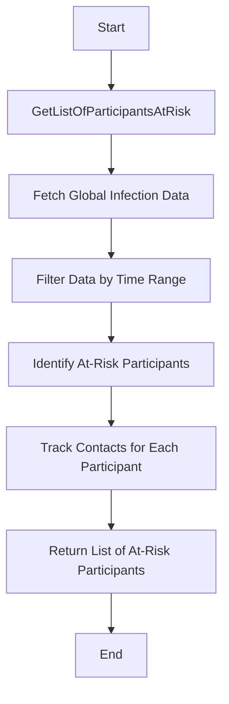

```mermaid
graph TD;
    A1[Start] --> B1[GetListOfParticipantsAtRisk]
    B1 --> C1[Fetch Global Infection Data]
    C1 --> D1[Filter Data by Time Range]
    D1 --> E1[Identify At-Risk Participants]
    E1 --> F1[Track Contacts for Each Participant]
    F1 --> G1[Return List of At-Risk Participants]
    G1 --> H1[End]
```