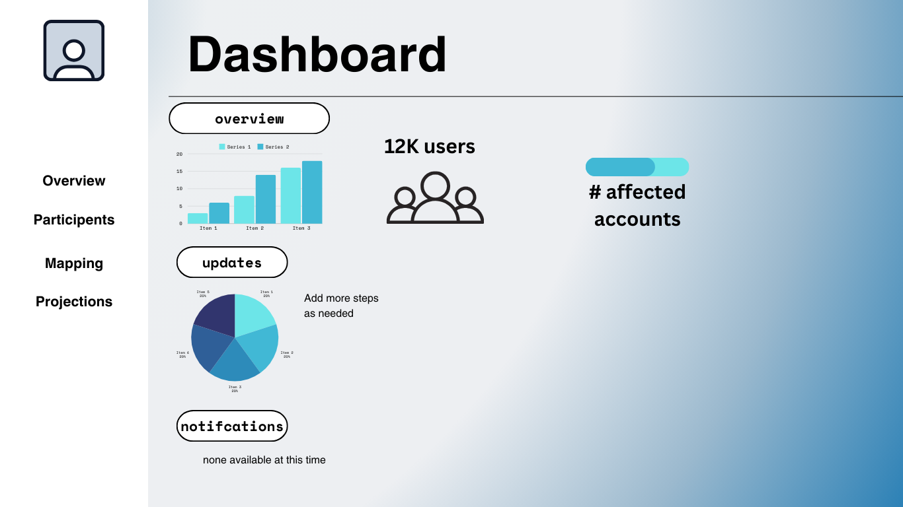
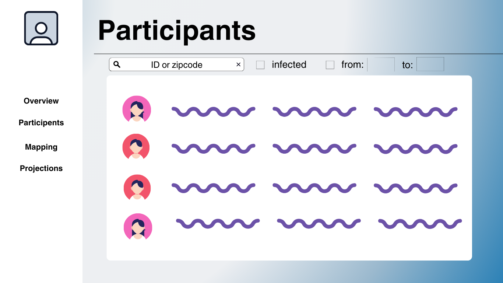
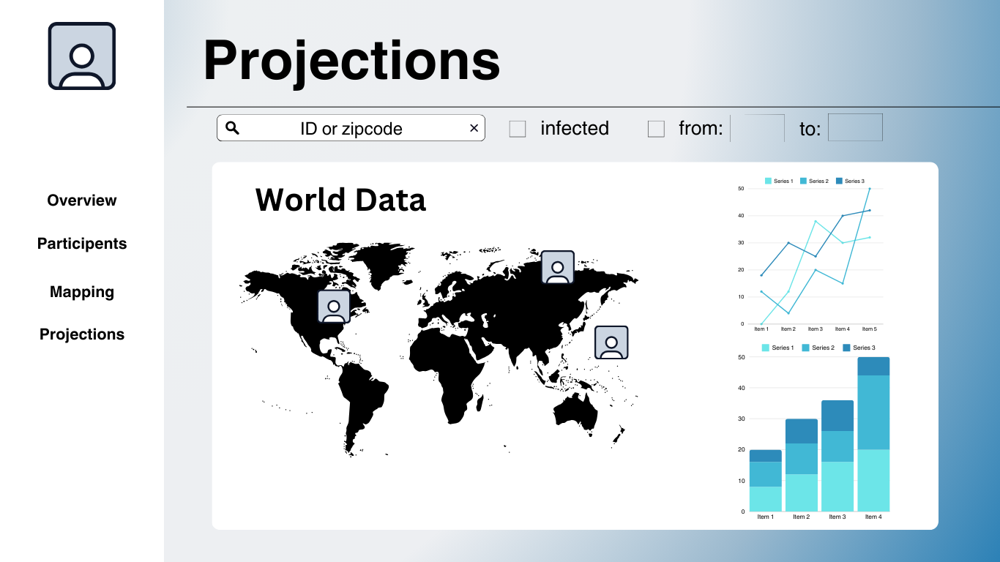

# Midterm Design Challenge: Front-End
Author: Judrianne Mahigne

NJIT Email: jm2489@njit.edu

This is the front end web development description for the fall 2024 IT490 - Systems Integration midterm design project.

## Overview
In order for researchers to interact with the contact tracing data, an interactive and user-friendly interface must be created by the front-end integration. Features like participant listing, infection trend viewing, location mapping, and projection generation will all be available on the front end.

- **Visualize data** retrieved from the back-end system.
- **Provide user-friendly controls** for interacting with the data, including filters, search, and drop-down options
- **Enable real-time updates** to reflect changes in infection status, projections, and participant data. This could also be manually set depending on the allowances on our API calls.

## Components
1. **Framework**
   - Use a front-end framework like **React.js**.
   - Use a graphing library provided by the API.
   - Use a mapping library like **Google Maps API** for customizable location visualization.
   > A good example of using custom Google Maps API can be seen here: https://www.youtube.com/watch?v=CdDXbvBFXLY
   - CSS: Use **Bootstrap**, which is an easy to use tool that is open-source and enhance responsiveness and visual design.


2. **Pages and Layouts**
   - **Dashboard Page**
   - **Participants Page**
   - **Map Visualization Page (Google Maps API)**
   - **Projections Page**

3. **API Calls**
   - Integrate with the communication layer to retrieve data for different views.
   - Handle user inputs and filters to refine data retrieval.

## Implementation

### 1. Framework/Library Choice
- **React.js** is recommended for this project due to its component-based architecture, extensive ecosystem, and performance optimizations.
- **CSS Framework**: Use a UI framework like **Bootstrap** to build responsive and mobile-friendly layouts.
- **Graphing & Mapping Libraries**:
  - **Graphing**: Whatever the REST API uses to build its graph like matplot for Python.
  - **Mapping**: Use **Google Maps API** for interactive map visualizations, as it’s lightweight and highly customizable.

### 2. Pages and Layouts

#### **Dashboard Page**
- Provides an overview of metrics, including total participants, current infection trends, and real-time alerts.
- **Layout**:
  - **Top Section**: Quick stats (total participants, total infections, recoveries).
  - **Middle Section**: Line chart displaying infection trends over time.
  - **Bottom Section**: Real-time notifications for new infections or changes in participant status.
- **API Calls**:
  - `GET /api/dashboard/infections`: Retrieves data for the infection trends chart.
  - `GET /api/dashboard/notifications`: Fetches real-time alerts for updates in participant status.

**Sample Layout**



#### **Participants Page**
- Allow users to search, filter, and view participants based on health status, location, and time range.
- **Layout**:
- **Top Section**: Search will be mostly on the top page that will populate down to the rest of the page when search is utilized.
  - **Search Bar**: Allows users to enter participant ID or search by zipcode for broader search.
  - **Filters**: Checkboxes or dropdowns for filtering by infection status, age, or time.
- **Main Section**: Data will fill the rest of the page that would have static naming columns for better readability.
  - **Data Table**: Displays participant details with sortable columns.
- **API Calls**:
  - `GET /api/participants`: Fetches the list of participants.
  - `GET /api/participants?infected=not_null`: Fetches only infected participants.
  - `GET /api/participants?ageRange=20-30`: Filters participants by age range.

**Sample Layout**

#### **Map Visualization Page**
- Display the locations of participants and infection hotspots on a mapping API such as Google API.
- **Layout**:
  - **Top Section**: Map filters.
  - **Main Section**: Interactive map showing participant locations (polygon mappingg style).
  - **Mini Pop ups**: Additional participant details will pop up when an area is clicked. It can also function as a zoom or "closer look" inspection that can filter searches in a granular way.
- **API Calls**:
  - `GET /api/locations?id=123`: Retrieves GPS coordinates for a specific participants location.
  - `GET /api/infections/map`: Retrieves data for infection hotspots for overview.
#### Example Code for API Integration (React.js)
- **Sample interactive map using Google Maps API:**
>The sample provided is from Google Maps API documentation: https://developers.google.com/maps/documentation/javascript/examples/boundaries-simple
```javascript
let map;
//@ts-ignore
let featureLayer;

async function initMap() {
  // Request needed libraries.
  const { Map } = await google.maps.importLibrary("maps");

  map = new Map(document.getElementById("map"), {
    center: { lat: 20.773, lng: -156.01 }, // Hana, HI
    zoom: 12,
    // In the cloud console, configure this Map ID with a style that enables the
    // "Locality" feature layer.
    mapId: "a3efe1c035bad51b", // <YOUR_MAP_ID_HERE>,
  });
  //@ts-ignore
  featureLayer = map.getFeatureLayer("LOCALITY");

  // Define a style with purple fill and border.
  //@ts-ignore
  const featureStyleOptions = {
    strokeColor: "#810FCB",
    strokeOpacity: 1.0,
    strokeWeight: 3.0,
    fillColor: "#810FCB",
    fillOpacity: 0.5,
  };

  // Apply the style to a single boundary.
  //@ts-ignore
  featureLayer.style = (options) => {
    if (options.feature.placeId == "ChIJ0zQtYiWsVHkRk8lRoB1RNPo") {
      // Hana, HI
      return featureStyleOptions;
    }
  };
}

initMap();
```

#### **Projections Page**
- Enable users to generate and view infection projections over a specified time.
- **Layout**:
- **Top Section**: Fields for choosing filters based on clients search options.
  - **Filter Section**: Input fields for selecting the time range (start and end dates).
- **Main Section**: Data will be displayed here.  
  - **Data Section**: Line chart or pie chart displaying projected infection rates over time.
- **API Calls**:
  - `GET /api/projections`: Sends a request to generate projections based on selected time ranges.

**Sample Layout**


### 3. API Integration
The front end will interact with the communication layer via REST API.

#### Example Code for API Integration
- **Sample Request with `javascript`:**
  ```javascript
  import React, { useEffect, useState } from 'react';
  import axios from 'axios';

  function ParticipantsPage() {
      const [participants, setParticipants] = useState([]);

      useEffect(() => {
          axios.get('/api/participants', {
              headers: {
                  'Authorization': 'API_TOKEN_HERE'
              }
          })
          .then(response => {
              setParticipants(response.data);
          })
          .catch(error => {
              console.error('Error fetching participants:', error);
          });
      }, []);

      return (
          <div>
              <h1>Participants</h1>
              <table>
                  <thead>
                      <tr>
                          <th>Participant ID</th>
                          <th>Age</th>
                          <th>Infected</th>
                      </tr>
                  </thead>
                  <tbody>
                      {participants.map(participant => (
                          <tr key={participant.ParticipantId}>
                              <td>{participant.ParticipantId}</td>
                              <td>{participant.Age}</td>
                              <td>{participant.Infected ? 'Yes' : 'No'}</td>
                          </tr>
                      ))}
                  </tbody>
              </table>
          </div>
      );
  }

  export default ParticipantsPage;
